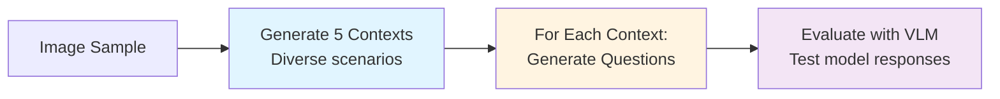
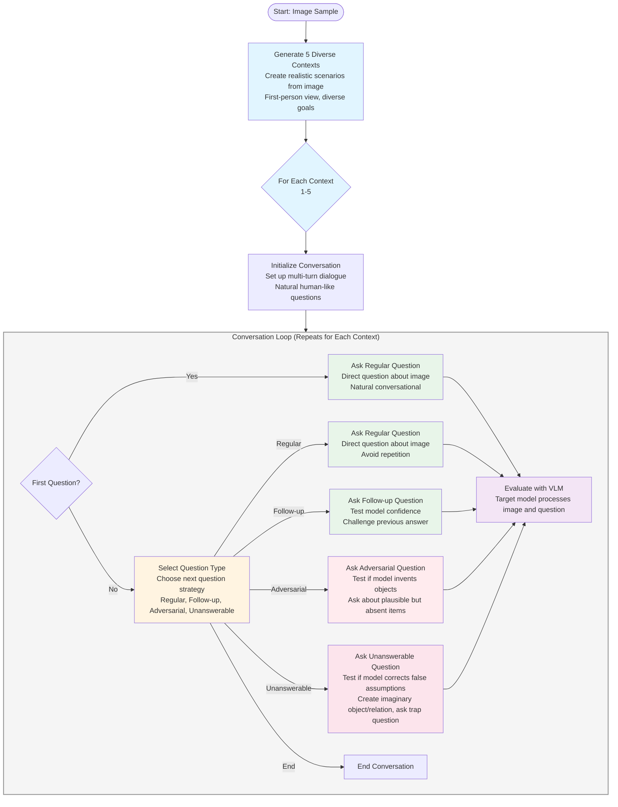

# VLM Image Understanding Examiner Workflow

## High-Level Overview

## Detailed Workflow

## Key Components

### 1. Context Generation
- Create 5 diverse realistic scenarios from the image
- First-person perspective ("I am seeing...")
- Each context focuses on different objects/relationships
- Each has a concrete goal requiring image understanding

### 2. Question Type Selection
- Strategically choose the next question to test the model
- Early in conversation: 4 question types available
- Later in conversation: 5 types (adds option to end)
- Selection based on conversation history and question diversity

### 3. Question Generation Types

#### Regular Questions
- Direct questions about visible image content
- Natural conversational style, relevant to context

#### Follow-up Questions
- Test model confidence and consistency
- Challenge previous answers, probe for details

#### Adversarial Questions
- Test if model invents objects that should be there but aren't
- Ask about plausible items that commonly appear with visible objects

#### Unanswerable Questions
- Test if model corrects false assumptions
- Process: Create imaginary object/relation, ask trap question assuming it exists
- Use definite references to trap model

### 4. VLM Evaluation
- Target vision-language model processes image and question
- Model generates response
